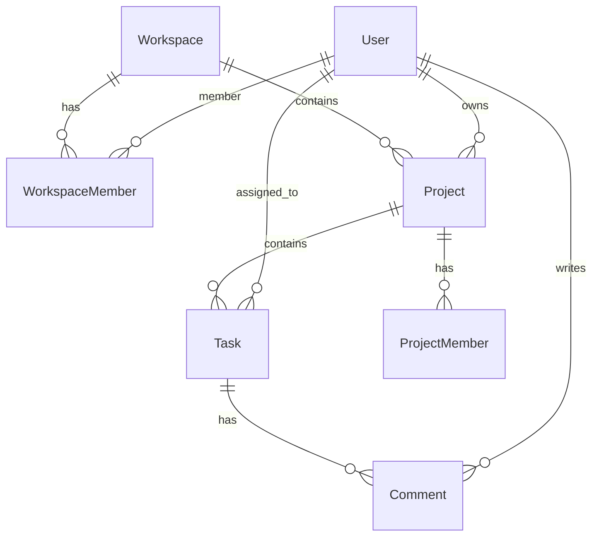

# 🚀 Milestone - Project Management App

Milestone is a modern, full-stack project management platform designed to help teams plan, collaborate, and deliver projects efficiently. Built with the **PERN Stack (PostgreSQL, Express.js, React.js, and Node.js)**, the application provides a centralized workspace for managing projects, tracking task progress, coordinating team activities, and monitoring performance through real-time analytics.

The platform streamlines the entire project lifecycle, from project planning and task assignment to progress monitoring and team collaboration. With secure authentication, role-based access control, interactive dashboards, calendar scheduling, and detailed project insights, Milestone enables organizations to improve productivity, enhance collaboration, and maintain complete visibility across their workflows.

---

**Live Demo**: [https://milestone-project-management-app.vercel.app](https://milestone-project-management-app.vercel.app)

---

## 🌟 Key Features

### 🏢 Workspace Management

* Create and manage multiple workspaces.
* Organize projects and team members within dedicated workspaces.
* Support for workspace-level permissions and administration.

### 📁 Project Management

* Create, update, and manage projects with ease.
* Track project progress and completion status.
* Centralized project overview and performance monitoring.

### ✅ Task Lifecycle Management

* Full CRUD operations for tasks.
* Assign tasks to team members.
* Manage priorities, deadlines, statuses, and task types.
* Track progress through customizable workflows.

### 👥 Team Collaboration

* Invite and manage team members.
* Task-level discussions and comments.
* Real-time collaboration across projects and workspaces.
* Role-based access control for secure teamwork.

### 📅 Calendar & Scheduling

* Visual project calendar for tracking deadlines.
* Schedule tasks and milestones efficiently.
* Improve planning and resource allocation.

### 📊 Analytics & Reporting

* Interactive dashboards powered by Recharts.
* Monitor project progress, task distribution, and team productivity.
* Gain actionable insights through real-time analytics.

### 🔐 Authentication & Authorization

* Secure authentication powered by Clerk.
* Social login and OAuth support.
* Role-based access control (RBAC) for workspace and project management.

### 🎨 Modern User Experience

* Fully responsive design for desktop and mobile devices.
* Dark and light mode support.
* Clean, modern, and intuitive interface built with Tailwind CSS.

---

## 🛠️ Technology Stack

- **Frontend**: React 19, React Router v7, Redux Toolkit, Tailwind CSS v4, Lucide Icons, Recharts, Date-fns.
- **Authentication**: Clerk React SDK.
- **Database Mapping**: Prisma ORM (configured for PostgreSQL).
- **Backend / API**: Ready for Node.js / Express integration (template directory in place).
- **Deployments**: Vercel configuration included.

---

## 📂 Project Structure

```
milestone-project-management-app/
├── backend - server/            # Backend server source (Express/Node.js) - [Template]
│
├── frontend - client/           # React frontend source (Vite + Tailwind CSS v4)
│   ├── public/                  # Static assets & icons
│   ├── src/
│   │   ├── app/                 # Redux Store configuration
│   │   ├── assets/              # Reusable icons, illustrations & Prisma schemas
│   │   ├── components/          # Reusable UI elements (Navbar, Sidebar, Calendar, Analytics, Dialogs)
│   │   ├── features/            # Redux slices (themeSlice, workspaceSlice)
│   │   ├── pages/               # Page components (Dashboard, Projects, Team, Details views)
│   │   ├── App.jsx              # Main routing and navigation layout
│   │   └── main.jsx             # React DOM root setup & Clerk integration
│   ├── .env.example             # Template for client-side environment variables
│   ├── index.html               # Main HTML entry point
│   ├── package.json             # Frontend dependencies and scripts
│   └── vite.config.js           # Vite config with React & Tailwind plugins
│
├── vercel.json                  # Automatic Vercel zero-config deploy configuration
├── package.json                 # Root orchestrator script config (helper scripts)
└── README.md                    # Project documentation
```

---

## ⚡ Local Setup and Installation

### Prerequisites
- [Node.js](https://nodejs.org/) (v18 or higher recommended)
- [npm](https://www.npmjs.com/) (or yarn / pnpm)

### 1. Clone the repository and install dependencies
Use the root orchestrator script to install the frontend client dependencies in one command:
```bash
npm run install:client
```

### 2. Configure Environment Variables
Inside the `frontend - client` directory, create a `.env` file (copied from `.env.example` or created fresh):
```env
VITE_CLERK_PUBLISHABLE_KEY=your_clerk_publishable_key
```

### 3. Run the Development Server
Launch the application from the root directory:
```bash
npm run dev
```
The client application will start running on **`http://localhost:5173/`**.

---

## 📦 Production & Deployment

### Vercel Deployment
This repository is configured for deployment on **Vercel** by selecting the `frontend - client` folder as the root/base directory.

To deploy:
1. Import your project repository in Vercel.
2. Under the **Project Settings**, select/set the **Root Directory** to `frontend - client`.
3. Vercel will automatically detect Vite as the framework and apply default build and install configurations.
4. **Environment Variables**: Add `VITE_CLERK_PUBLISHABLE_KEY` in the Vercel project settings under **Environment Variables**.
5. Deploy! Vercel will read `frontend - client/vercel.json` to handle proper client-side SPA routing rewrites.

---

## 🗄️ Database Model (Prisma)

The Prisma schema is located at `frontend - client/src/assets/schema.prisma` and is ready to be mapped to a PostgreSQL database instance:



Key models defined:
- **User**: Maps profiles syncing from Clerk auth provider.
- **Workspace & WorkspaceMember**: Allows segmenting work environments.
- **Project & ProjectMember**: Represents group objectives and participants.
- **Task & Comment**: Task cards linked with discussions.
