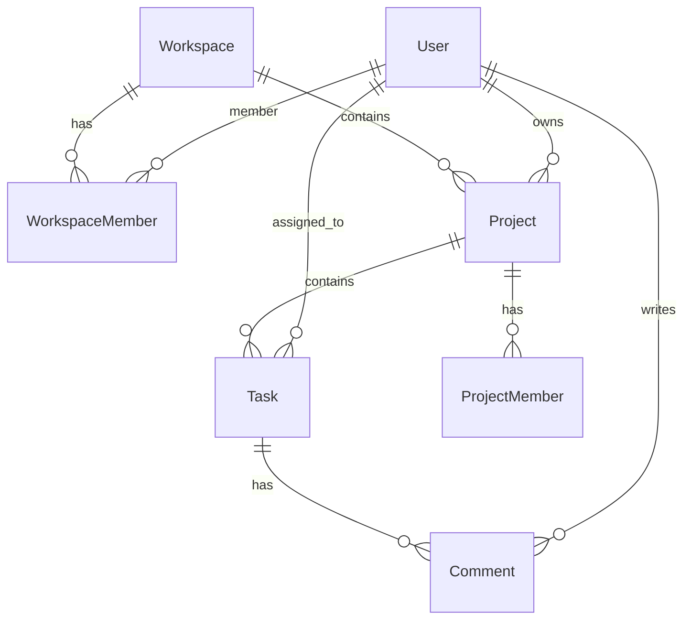

# 🚀 Milestone - Project Management App

Milestone is a premium, state-of-the-art Project Management application built using the modern **PERN** stack (PostgreSQL, Express, React, Node.js). It provides a full-featured workspace environment designed to help teams collaborate, track tasks in real-time, analyze performance metrics, and streamline project lifecycles.

---

**Live Demo**: [https://milestone-project-management-app.vercel.app](https://milestone-project-management-app.vercel.app)

---

## ✨ Features

- **💼 Workspace & Organization Hub**: Toggle, create, and customize separate workspaces with localized projects and independent teams.
- **📊 Interactive Dashboard**: At-a-glance analytics with progress tracking, priority distribution, task counts, and a chronological recent activity feed.
- **📁 Advanced Project & Task Management**:
  - Full CRUD operations on projects and tasks.
  - Set task properties: status (Todo, In Progress, Done), type (Task, Bug, Feature, Improvement), priority (Low, Medium, High), assignees, and due dates.
  - Interactive project calendar mapping all task deadlines.
  - Granular task details page with discussion comments and status logging.
- **🔐 Secure Authentication via Clerk**: Robust enterprise-grade authentication including OAuth sign-in flows and profile management via Clerk.
- **👥 Team Collaboration**:
  - Manage project and workspace memberships.
  - Workspace role permissions (Admin, Member) and direct teammate invite dialogs.
- **🎨 Dark Mode & UI Aesthetics**: Fully responsive layout with custom-tailored HSL colors, smooth transitions, glassmorphism UI accents, and persistent theme configurations (Light / Dark mode).

---

## 🛠️ Technology Stack

- **Frontend**: React 19, React Router v7, Redux Toolkit, Tailwind CSS v4, Lucide Icons, Recharts, Date-fns.
- **Authentication**: Clerk React SDK.
- **Database Mapping**: Prisma ORM (configured for PostgreSQL).
- **Backend / API**: Ready for Node.js / Express integration (template directory in place).
- **Deployments**: Vercel configuration included.

---

## 📂 Project Structure

```
milestone-project-management-app/
├── backend - server/            # Backend server source (Express/Node.js) - [Template]
│
├── frontend - client/           # React frontend source (Vite + Tailwind CSS v4)
│   ├── public/                  # Static assets & icons
│   ├── src/
│   │   ├── app/                 # Redux Store configuration
│   │   ├── assets/              # Reusable icons, illustrations & Prisma schemas
│   │   ├── components/          # Reusable UI elements (Navbar, Sidebar, Calendar, Analytics, Dialogs)
│   │   ├── features/            # Redux slices (themeSlice, workspaceSlice)
│   │   ├── pages/               # Page components (Dashboard, Projects, Team, Details views)
│   │   ├── App.jsx              # Main routing and navigation layout
│   │   └── main.jsx             # React DOM root setup & Clerk integration
│   ├── .env.example             # Template for client-side environment variables
│   ├── index.html               # Main HTML entry point
│   ├── package.json             # Frontend dependencies and scripts
│   └── vite.config.js           # Vite config with React & Tailwind plugins
│
├── vercel.json                  # Automatic Vercel zero-config deploy configuration
├── package.json                 # Root orchestrator script config (helper scripts)
└── README.md                    # Project documentation
```

---

## ⚡ Local Setup and Installation

### Prerequisites
- [Node.js](https://nodejs.org/) (v18 or higher recommended)
- [npm](https://www.npmjs.com/) (or yarn / pnpm)

### 1. Clone the repository and install dependencies
Use the root orchestrator script to install the frontend client dependencies in one command:
```bash
npm run install:client
```

### 2. Configure Environment Variables
Inside the `frontend - client` directory, create a `.env` file (copied from `.env.example` or created fresh):
```env
VITE_CLERK_PUBLISHABLE_KEY=your_clerk_publishable_key
```

### 3. Run the Development Server
Launch the application from the root directory:
```bash
npm run dev
```
The client application will start running on **`http://localhost:5173/`**.

---

## 📦 Production & Deployment

### Vercel Deployment
This repository is configured for deployment on **Vercel** by selecting the `frontend - client` folder as the root/base directory.

To deploy:
1. Import your project repository in Vercel.
2. Under the **Project Settings**, select/set the **Root Directory** to `frontend - client`.
3. Vercel will automatically detect Vite as the framework and apply default build and install configurations.
4. **Environment Variables**: Add `VITE_CLERK_PUBLISHABLE_KEY` in the Vercel project settings under **Environment Variables**.
5. Deploy! Vercel will read `frontend - client/vercel.json` to handle proper client-side SPA routing rewrites.

---

## 🗄️ Database Model (Prisma)

The Prisma schema is located at `frontend - client/src/assets/schema.prisma` and is ready to be mapped to a PostgreSQL database instance:



Key models defined:
- **User**: Maps profiles syncing from Clerk auth provider.
- **Workspace & WorkspaceMember**: Allows segmenting work environments.
- **Project & ProjectMember**: Represents group objectives and participants.
- **Task & Comment**: Task cards linked with discussions.
